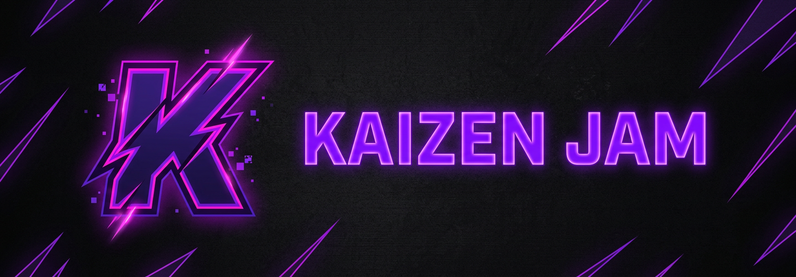

<div align="center">


### 改善 — *continuous improvement, applied to sound.*

<br>

**Crystal-clear audio streaming • Seamless queue management • Zero bloat. Zero compromises.**

[](https://nodejs.org)
[](https://discord.js.org)
[](LICENSE)
[](#)

---

*The standalone JavaScript music bot spinoff of the main [Kaizen](https://github.com/Karmanya03) Rust-based bot.*
*Think of it as the acoustic version of the metal album.*

</div>

<br>

## 🤔 What is this thing?

Kaizen-JAM is a **Discord music bot** that actually works. Revolutionary concept, I know.

While the main Kaizen bot is written in Rust (because we like suffering), this one is pure JavaScript — lightweight, fast to deploy, and doesn't require you to fight the borrow checker at 3 AM.

It joins your voice channel, plays music from YouTube, and manages a queue. That's it. It does one thing and does it well. Unlike your ex.

<br>

## ✨ Features (aka "why should I care?")

| Feature | Description | Vibe Check |
|---------|------------|------------|
| ▶️ `/play` | Play a song from YouTube URL or search query | Maximum vibes |
| ⏭️ `/skip` | Skip the current track (supports vote-skip) | Democracy in action |
| ⏹️ `/stop` | Stop playback and clear the queue | Party's over |
| 📜 `/queue` | View the current queue with pagination | Organized chaos |
| 🎵 `/nowplaying` | See what's currently playing with a progress bar | Aesthetic AF |
| 🔊 `/join` | Summon the bot to your voice channel | *teleports behind you* |
| 👋 `/leave` | Disconnect the bot | Sayonara |
| 👤 `/avatar` | Get anyone's profile picture in glorious HD | Stalking made easy |
| 🏓 `/ping` | Check bot latency | Is this thing on? |
| 📊 `/serverinfo` | Server stats and info | Flexing your server |
| ❓ `/help` | List all commands | You're reading this |
| 🔨 `/ban` | Ban a user | Hammer time |
| 👢 `/kick` | Kick a user | Gentle nudge (out the door) |
| 🧹 `/purge` | Bulk delete messages | Spring cleaning |

<br>

## 🏗️ Architecture (for the nerds)

```
Kaizen-JAM/
├── src/
│   ├── commands/
│   │   ├── music/          # The good stuff - play, skip, queue, etc.
│   │   ├── moderation/     # Ban hammer & friends
│   │   └── utility/        # Ping, avatar, help - the essentials
│   ├── events/             # Discord event listeners
│   ├── handlers/           # Command & event loading magic
│   ├── utils/              # Embeds, buttons, security helpers
│   ├── config.js           # Emojis, limits, and vibes config
│   ├── deploy-commands.js  # Slash command registration
│   └── index.js            # Where the magic starts
├── .env.example            # Template for your secrets
├── setup.sh                # One-click setup script
└── package.json            # Dependencies & scripts
```

<br>

## 🚀 Quick Start (speedrun any%)

### Prerequisites

You need these. Non-negotiable. Like oxygen.

- **Node.js** v18+ ([download](https://nodejs.org))
- **ffmpeg** (for audio processing, because raw bytes don't sound great)
- **A Discord Bot Token** ([get one here](https://discord.com/developers/applications))
- **A working internet connection** (I hope)
- **Two brain cells** (minimum)

### Option A: The Easy Way (recommended for humans)

```bash
# Clone this bad boy
git clone https://github.com/Karmanya03/Kaizen-JAM.git
cd Kaizen-JAM

# Run the setup script - it does everything for you
chmod +x setup.sh
./setup.sh
```

The setup script will:
1. Detect your platform (Linux, macOS, WSL, even Termux because we're inclusive)
2. Install system dependencies
3. Create your `.env` file from the template
4. Install all npm packages
5. Optionally deploy slash commands
6. Make you coffee (just kidding, but wouldn't that be nice?)

### Option B: The Manual Way (for control freaks)

```bash
git clone https://github.com/Karmanya03/Kaizen-JAM.git
cd Kaizen-JAM

# Install dependencies
npm install

# Setup your environment
cp .env.example .env
# Now edit .env with your actual bot token & client ID

# Deploy slash commands to Discord
npm run deploy

# Start the bot
npm start

# Or use dev mode (auto-restart on file changes)
npm run dev
```

<br>

## 🔐 Environment Variables

| Variable | Required | Description |
|----------|----------|-------------|
| `DISCORD_TOKEN` | Yes | Your bot token. Guard this with your life. |
| `CLIENT_ID` | Yes | Your application's client ID |
| `GUILD_ID` | No | For dev testing - instant slash command updates |
| `OWNER_IDS` | No | Comma-separated Discord IDs for bot owners |

> ⚠️ **NEVER** commit your `.env` file. The `.gitignore` is already set up to protect you from yourself.

<br>

## 🛠️ Tech Stack (what's under the hood)

| Tech | Why |
|------|-----|
| **discord.js v14** | The backbone. The OG. The GOAT of Discord libraries. |
| **@discordjs/voice** | Voice connection handling that actually works |
| **@discordjs/opus** | Opus encoding for crystal-clear audio |
| **discord-player** | High-level music player abstraction |
| **discord-player-youtubei** | YouTube extraction that doesn't break every Tuesday |
| **mediaplex** | Media processing utilities |
| **ffmpeg-static** | Audio processing without system ffmpeg dependency |
| **sodium-native** | Encryption for voice connections |
| **dotenv** | Because hardcoding tokens is a crime |

<br>

## 🎮 Usage

1. Invite the bot to your server using the OAuth2 URL from Discord Developer Portal
2. Join a voice channel
3. Type `/play never gonna give you up`
4. Get rickrolled by your own bot
5. Question your life choices
6. Realize the audio quality is actually fire
7. Play actual music this time

<br>

## 🤝 Contributing

PRs are welcome! Found a bug? Open an issue. Want a feature? Open an issue. Want to complain? Also open an issue, honestly I respect the dedication.

1. Fork the repo
2. Create your feature branch (`git checkout -b feature/amazing-feature`)
3. Commit your changes (`git commit -m 'Add some amazing feature'`)
4. Push to the branch (`git push origin feature/amazing-feature`)
5. Open a Pull Request
6. Wait patiently while I review it at 3 AM

<br>

## 📄 License

MIT License. Do whatever you want with it. Just don't blame me when your Discord server turns into a 24/7 lo-fi hip hop radio.

<br>

---

<div align="center">

**━━━━━━━━━━━━━━━━━━**

*Built with mass sleep deprivation, mass caffeine, and mass vibes by [Karmanya03](https://github.com/Karmanya03)*

**改善** — *"Today better than yesterday, tomorrow better than today."*

━━━━━━━━━━━━━━━━━━

</div>